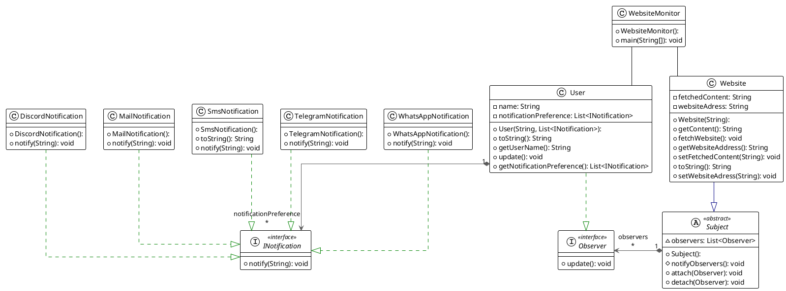

# Observer Pattern

```plantuml
@startuml

!theme plain
top to bottom direction
skinparam linetype ortho

class DiscordNotification {
  + DiscordNotification(): 
  + notify(String): void
}
interface INotification << interface >> {
  + notify(String): void
}
class MailNotification {
  + MailNotification(): 
  + notify(String): void
}
interface Observer << interface >> {
  + update(): void
}
class SmsNotification {
  + SmsNotification(): 
  + toString(): String
  + notify(String): void
}
abstract Subject << abstract >> {
  + Subject(): 
  ~ observers: List<Observer>
  # notifyObservers(): void
  + attach(Observer): void
  + detach(Observer): void
}
class TelegramNotification {
  + TelegramNotification(): 
  + notify(String): void
}
class User {
  + User(String, List<INotification>): 
  - name: String
  - notificationPreference: List<INotification>
  + toString(): String
  + getUserName(): String
  + update(): void
  + getNotificationPreference(): List<INotification>
}
class Website {
  + Website(String): 
  - fetchedContent: String
  - websiteAdress: String
  + getContent(): String
  + fetchWebsite(): void
  + getWebsiteAddress(): String
  + setFetchedContent(String): void
  + toString(): String
  + setWebsiteAdress(String): void
}
class WebsiteMonitor {
  + WebsiteMonitor(): 
  + main(String[]): void
}
class WhatsAppNotification {
  + WhatsAppNotification(): 
  + notify(String): void
}

WebsiteMonitor -- User
WebsiteMonitor -- Website
DiscordNotification   -[#008200,dashed]-^  INotification        
MailNotification      -[#008200,dashed]-^  INotification        
SmsNotification       -[#008200,dashed]-^  INotification        
Subject              "1" *-[#595959,plain]left-> "observers\n*" Observer             
TelegramNotification  -[#008200,dashed]-^  INotification        
User                 "1" *-[#595959,plain]-> "notificationPreference\n*" INotification        
User                  -[#008200,dashed]-^  Observer             
Website               -[#000082,plain]-^  Subject              
WhatsAppNotification  -[#008200,dashed]-^  INotification        
@enduml
```