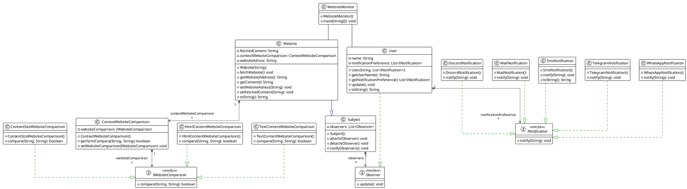

# Aufgabe 1
use strategy pattern

es gibt libraries die bei dem text helfen (\
 entfernen)   "Jsoup"

# Aufgabe 2

```plantuml
@startuml

!theme plain
top to bottom direction
skinparam linetype ortho

class ContentSizeWebsiteComparison {
  + ContentSizeWebsiteComparison(): 
  + compare(String, String): boolean
}
class ContextWebsiteComparison {
  + ContextWebsiteComparison(): 
  - websiteComparison: IWebsiteComparison
  + performCompare(String, String): boolean
  + setWebsiteComparison(IWebsiteComparison): void
}
class DiscordNotification {
  + DiscordNotification(): 
  + notify(String): void
}
class HtmlContentWebsiteComparison {
  + HtmlContentWebsiteComparison(): 
  + compare(String, String): boolean
}
interface INotification << interface >> {
  + notify(String): void
}
interface IWebsiteComparison << interface >> {
  + compare(String, String): boolean
}
class MailNotification {
  + MailNotification(): 
  + notify(String): void
}
interface Observer << interface >> {
  + update(): void
}
class SmsNotification {
  + SmsNotification(): 
  + notify(String): void
  + toString(): String
}
class Subject {
  + Subject(): 
  ~ observers: List<Observer>
  + attach(Observer): void
  + detach(Observer): void
  # notifyObservers(): void
}
class TelegramNotification {
  + TelegramNotification(): 
  + notify(String): void
}
class TextContentWebsiteComparison {
  + TextContentWebsiteComparison(): 
  + compare(String, String): boolean
}
class User {
  + User(String, List<INotification>): 
  - name: String
  - notificationPreference: List<INotification>
  + getUserName(): String
  + getNotificationPreference(): List<INotification>
  + update(): void
  + toString(): String
}
class Website {
  + Website(String): 
  - fetchedContent: String
  ~ contextWebsiteComparison: ContextWebsiteComparison
  - websiteAdress: String
  + fetchWebsite(): void
  + getWebsiteAddress(): String
  + getContent(): String
  + setWebsiteAdress(String): void
  + setFetchedContent(String): void
  + toString(): String
}
class WebsiteMonitor {
  + WebsiteMonitor(): 
  + main(String[]): void
}
class WhatsAppNotification {
  + WhatsAppNotification(): 
  + notify(String): void
}

WebsiteMonitor -- User
WebsiteMonitor -- Website
ContentSizeWebsiteComparison  -[#008200,dashed]-^  IWebsiteComparison           
ContextWebsiteComparison     "1" *-[#595959,plain]-> "websiteComparison\n1" IWebsiteComparison           
DiscordNotification           -[#008200,dashed]-^  INotification                
HtmlContentWebsiteComparison  -[#008200,dashed]-^  IWebsiteComparison           
MailNotification              -[#008200,dashed]-^  INotification                
SmsNotification               -[#008200,dashed]-^  INotification                
Subject                      "1" *-[#595959,plain]-> "observers\n*" Observer                     
TelegramNotification          -[#008200,dashed]-^  INotification                
TextContentWebsiteComparison  -[#008200,dashed]-^  IWebsiteComparison           
User                         "1" *-[#595959,plain]-> "notificationPreference\n*" INotification                
User                          -[#008200,dashed]-^  Observer                     
Website                      "1" *-[#595959,plain]-> "contextWebsiteComparison\n1" ContextWebsiteComparison     
Website                       -[#000082,plain]-^  Subject                      
WhatsAppNotification          -[#008200,dashed]-^  INotification                
@enduml
```