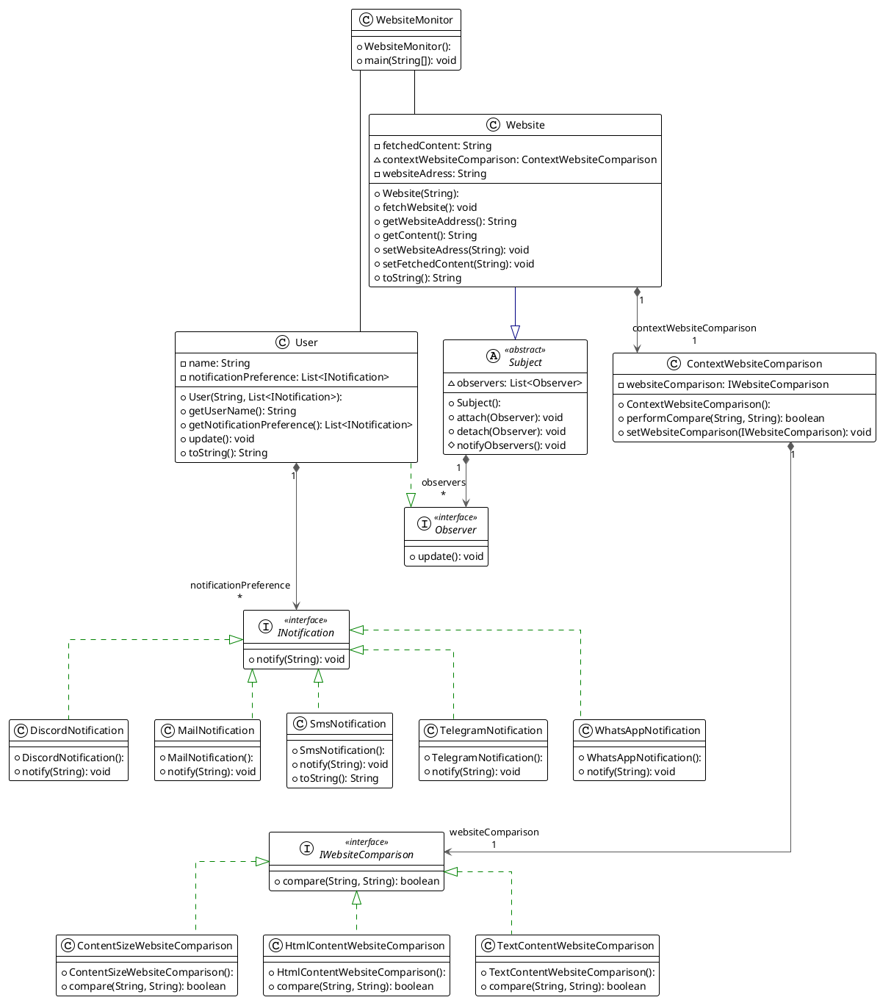

# Aufgabe 1
use strategy pattern

es gibt libraries die bei dem text helfen (\
 entfernen)   "Jsoup"

# Aufgabe 2

das war relativ auwendig das puml zu formatieren :(

# Aufgabe 3
????

# Aufgabe 4
commit to github lol