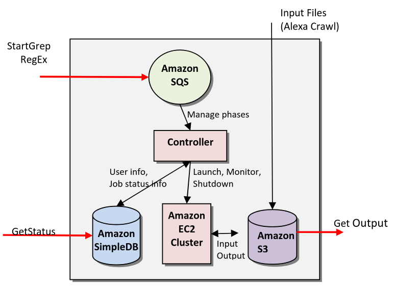

# Aufgabe 1

## Advantages of a Mainframe

- High computing power
- High I/O
- Availibility/Reliability
- Security
  - Not connected to the internet
- Authority
- Single point of truth

## Disadvantages of a Mainframe

- Expensive upfront
- Moderate maintanance costs

## Advantages of the Cloud

- Rent Cloud instead of owning your Server ```---``` | WICHTIG FÜR KLAUSUR
- Managed by Specialists ```--------------------``` | WICHTIG FÜR KLAUSUR
- Decentralized ```-----------------------------``` | WICHTIG FÜR KLAUSUR
- Scalability
- Innovation/Modernization, Cloud gets the newest Hardware over time
- Time to Market (to get it operational)

## Disadvantages of the Cloud

- Rent Cloud instead of owning your Server

## Mainframe Computing GPT

- Definition: Mainframes are powerful, centralized computers designed for handling large-scale transaction processing and data-intensive workloads.
- Architecture: Centralized, with all processing and storage resources residing in a single system.
- Characteristics: Offers robust security, reliability, and scalability, excelling in mission-critical workloads and providing high availability.
- Applications: Widely used in banking, healthcare, and government industries.
- Drawbacks: Can be expensive to acquire and maintain, requiring specialized expertise and infrastructure. Upgrades and scaling can be complex and time-consuming.
- Cost: Typically costly due to high upfront costs and maintenance expenses.
- Scalability: Limited scalability options, often requiring additional hardware investments and potential downtime during upgrades.
- Security: Provides strong physical and logical security measures.
- Reliability: Known for high levels of reliability and uptime.
- Flexibility: Offers limited flexibility due to its centralized architecture, making upgrades and adaptations to new technologies challenging.

## Cloud Computing GPT

- Definition: Delivers on-demand services over the Internet, providing users with scalable and flexible solutions.
- Architecture: Utilizes a distributed architecture, with computing resources spread across multiple servers and data centers.
- Characteristics: Offers flexibility, scalability, and cost-efficiency.
- Applications: Finds applications in various domains, including web and mobile applications, data analytics, AI, and IoT.
- Drawbacks: May face concerns regarding data privacy and security. Dependence on internet connectivity could introduce latency and availability issues. Managing costs and optimizing resource usage is crucial.
- Cost: Operates on a pay-as-you-go model, allowing businesses to reduce capital expenditures and pay only for the resources used.
- Scalability: Provides seamless scalability, allowing rapid adjustments to resource demands without causing downtime.
- Security: Requires implementing robust security measures to protect data in transit and at rest.
- Reliability: Relies on distributing resources across multiple servers and data centers to ensure high reliability.
- Flexibility: Offers high flexibility, enabling rapid deployment and scalability of applications.

## Change over time

### Cloud is:

- More cost efficient
- No training because Cloud is the same in every company
- Less training costs
- Less key employees
- Easy to scale up and down
- More accessible over the world

# Aufgabe 2

The paper "Cloud Architectures" by Jinesh Varia from Amazon Web Services (AWS) delves into the design and implementation of software applications leveraging cloud infrastructure. Here's a detailed summary that captures its nuances:
Introduction and Motivation

The paper illustrates how applications built on cloud architectures utilize on-demand internet services. Such applications:

- Use underlying infrastructure only when needed.
- Draw resources on-demand.
- Perform specific tasks and release resources post-task.
- Scale elastically based on resource requirements.

Example Application

The paper provides a case study of an application that uses AWS's on-demand infrastructure. This application performs pattern matching across millions of web documents. Key components include:

- Virtual Servers: Hundreds are deployed on-demand.
- Hadoop Framework: Utilized for parallel computation.
- Resource Management: Servers are shut down post-completion, making the process cost-efficient and requiring minimal programming effort.

Best Practices for AWS Services

The second section discusses best practices for building scalable applications using AWS services, specifically Amazon S3, Amazon SQS, Amazon SimpleDB, and Amazon EC2:

Amazon S3 Simple Storage Service

- Ideal for storing large, write-once, read-many objects like media files.
- Recommended to use with SimpleDB to query objects using their metadata.

Amazon SQS Simple Queueing Service

- Buffer
- Suitable for handling small, short-lived transient messages.
- Best used in conjunction with SimpleDB for managing job statuses in asynchronous systems.

Amazon SimpleDB

- NoSQL Database
- Designed for querying lightweight attribute data.
- Useful in conjunction with S3 and SQS for creating robust, scalable architectures.

Amazon EC2 Elastic Computing Cloud

- Creates instances for Computing
- Automate instance management to enhance efficiency.
- Enable dynamic scaling by adding compute instances on-the-fly.
- Secure AWS credentials to prevent unauthorized access.

Advanced Practices

The paper also highlights advanced techniques:

- Visibility Timeout in SQS: Ensures that messages are re-queued if not processed within a specific time, enhancing reliability.
- Multithreading in SimpleDB: Improves performance by running multiple GetAttributes calls in parallel.
- Integrated Frameworks: Using multiple AWS services together (e.g., combining SQS and SimpleDB) to create resilient, state-aware applications.

Security Considerations

An important aspect discussed is the security of AWS credentials:

- Avoid embedding credentials in Amazon Machine Images (AMI).
- Use RSA keypairs to encrypt credentials and decrypt them securely upon boot.

Business Benefits

Building applications using cloud architectures offers several business advantages:

- Cost Efficiency: Almost zero upfront infrastructure investment.
- Scalability: Easy to scale resources up or down based on demand.
- Operational Simplification: Reduces complexity in managing large-scale infrastructures.

Conclusion

The paper concludes by emphasizing that cloud architectures address several challenges of traditional data processing systems, providing scalable, cost-effective, and reliable solutions.

This comprehensive overview includes nuances such as best practices for specific AWS services, security measures, and advanced usage scenarios that are often overlooked in general discussions about cloud computing.

# Aufgabe 3

Website class can be multithreaded to enable cloud advantages. Webiste is an Observer and contains all the logic for comparing old with new websites.

1. SimpleDB for storing Users.
2. EC2 for updating and checking the Website class (Subject).
3. S3 for saving the Website itself.
4. Controller as Main for running and creating multiple instances for the Website class.
5. SQS for adding new Websites/Users.
6. SNS Simple Notification Service for Notifying Users

The only difference would be connecting the SimpleDB to the EC2 instead of the Controller 
AND the input into the S3 is performed by the EC2 instead of a dedicated Crawler.


