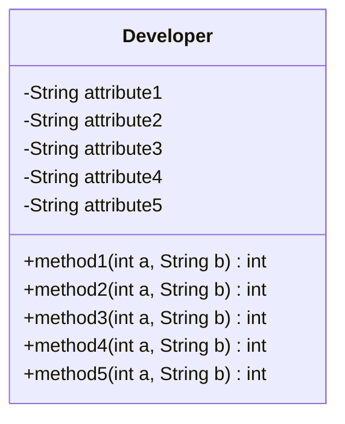
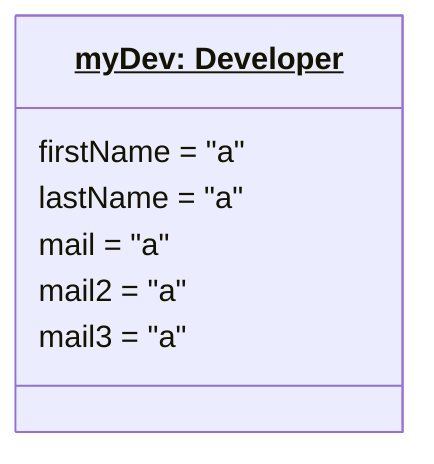

# Class Diagram

```mermaid
classDiagram
    class D["Developer"]{
    -String attribute1
    -String attribute2
    -String attribute3
    -String attribute4
    -String attribute5
    +method1(int a, String b) int
    +method2(int a, String b) int
    +method3(int a, String b) int
    +method4(int a, String b) int
    +method5(int a, String b) int
    }
```
# Object Diagram

```mermaid
classDiagram
    class D["<u>myDev: Developer"]{
        firstName = "a"
        lastName = "a"
        mail = "a"
        mail2 = "a"
        mail3 = "a"
    }
```