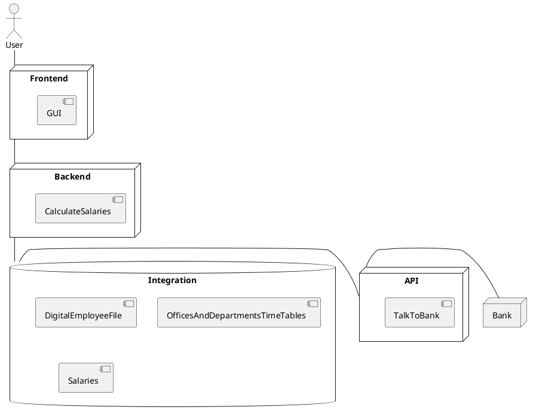
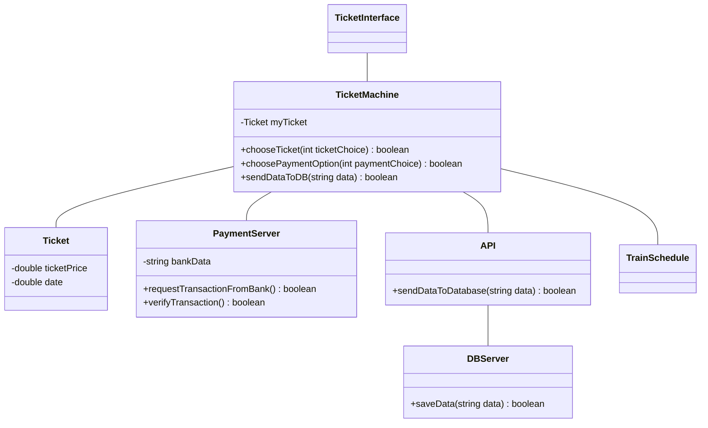
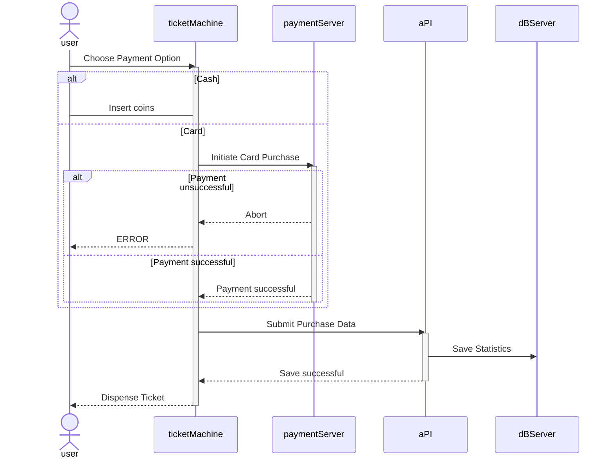
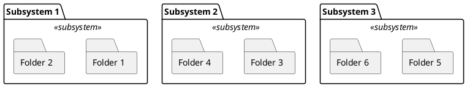
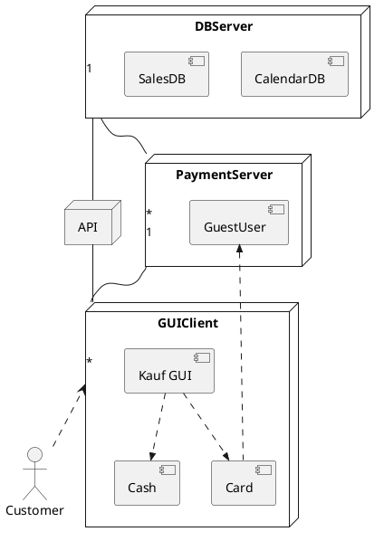

# Aufgabe 1
## This is a Microservice Architecture

# Aufgabe 2

## Introducing Peer to Peer Architecture in Gaming

Monolithic Structure is too expensive and too much data has to be sent

Peer to Peer Network:  
Every Node(Player) only has a small subset of the Data. Just as much as it is needed and a bit more for redundancy.

# Aufgabe 3
## Ticket machine used by passengers at a railway station

Views:
1. Logical view <=> Class Diagram

2. Process view <=> Sequence Diagram

### 3. Development view <=> packages?

### This Diagram is supposed to show us which parts or the programm are connected closely together. For example Authentication is a "package"(not subsystem) that has multiple classes that ensure authentication

### 4. Physical/Deployment view <=> darstellung der distribution?

### This Diagram is supposed to show us on which servers and how our program is deployed/implemented 

# Aufgabe 4
1. Event Based - publish subscriber (wer will kann es sehen)
2. Distributed System - Peer to Peer / Client Server
3. Event Based - Broker