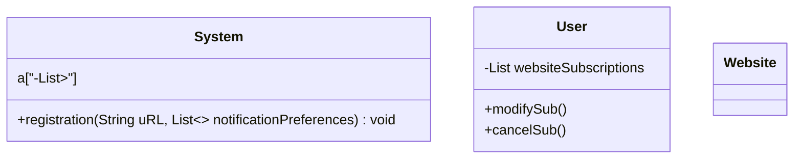
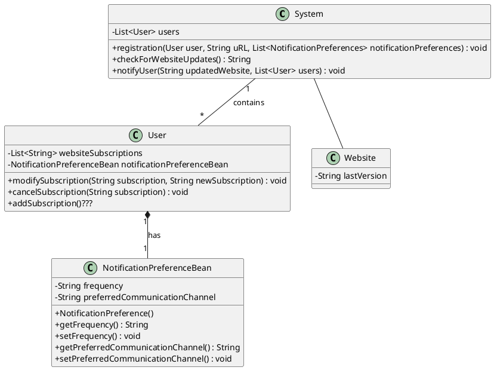

# Aufgabe 1
## website monitor

Aggregation:

Leere Raute, das Teil kann auch ohne dem Ganzen existieren z.B. Auto ohne Reifen.

Composition:

Gefüllte Raute, das Teil kann NICHT ohne dem Ganzen existieren z.B. Arm ohne Körper.

# Aufgabe 2

# Aufgabe 3
create crc in markdown table

| aasdasd | b                  |
| ------- | ------------------ |
|         | asdlashdlashdjkash |
|         |                    |

tabelle komisch habs in google gemacht