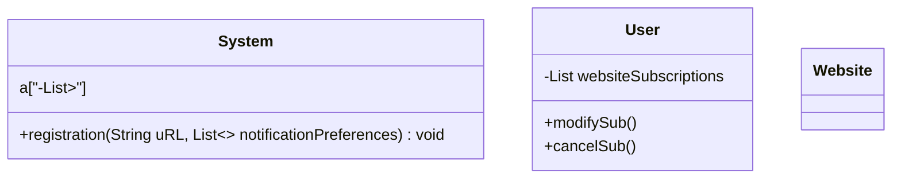
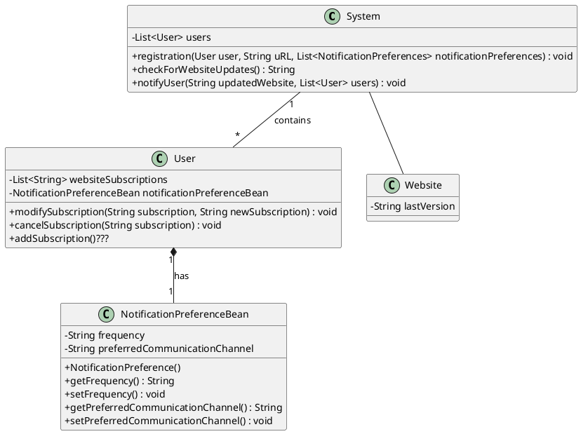
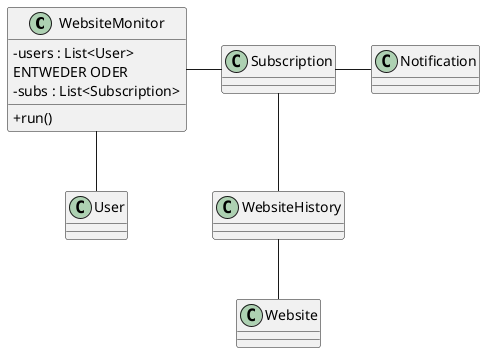

# Aufgabe 1
## website monitor

### Locaizyc

# KLAUSURRELEVANT

Aggregation:

Leere Raute, das Teil kann auch ohne dem Ganzen existieren z.B. Auto ohne Reifen.

Composition:

Gefüllte Raute, das Teil kann NICHT ohne dem Ganzen existieren z.B. Arm ohne Körper.

# Aufgabe 2 KLAUSURRELEVANT

## GRASP THEROIES KLAUSURRELEVANT

### 1. Controller Principle: KLAUSURRELEVANT
Make 1 Class responsible for the given Service (Notification, Programm, Payment) 
(low coupling)

Problem:  
Who should be responsible for handling an input
system event?

Solution:  
Assign the responsibility for receiving or handling
a system event message to a class representing
the overall system, device, or subsystem (facade
controller) or a use case scenario within which the
system event occurs (use case controller)
### 2. Creator Principle: KLAUSURRELEVANT
Conditions of when a Class should create objects of other Classes 
(intuitively the controller)

Assign class B responsibility of creating instance
of class A if
- B aggregates A objects
- B contains A objects
- B records instances of A objects
- B closely uses A objects
- B has the initializing data for creating A objects

When there is a choice, prefer
- B aggregates or contains A objects

Key idea: Creator needs to keep reference
anyway and will frequently use the created object
### 3. Information Expert Principle: KLAUSURRELEVANT
Problem: What is a general principle of assigning
responsibilities to objects?

Solution: Assign a responsibility to the
information expert, the class that has the
information necessary to fulfill the
responsibility

Start assigning responsibilities by clearly stating
responsibilities!

Typically follows common intuition

Design Classes (Software Classes) instead of
Conceptual Classes
- If Design Classes do not yet exist, look in Domain Model
for fitting abstractions (-> low representational gap)

# Aufgabe 3
create crc in markdown table

| aasdasd | b                  |
| ------- | ------------------ |
|         | asdlashdlashdjkash |
|         |                    |

tabelle komisch habs in google gemacht