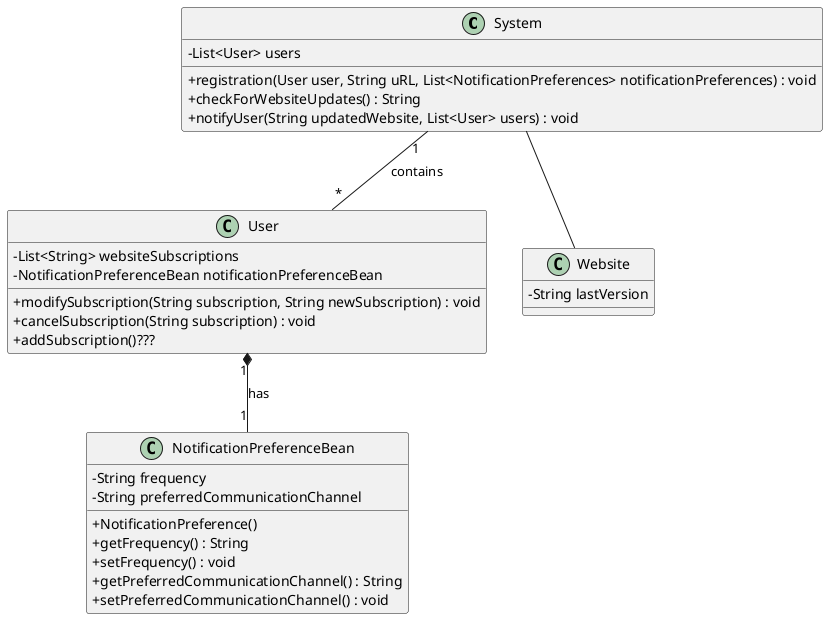

# Aufgabe 1
um website zu bekommen "curl"

# Aufgabe 2
Afferent (incoming) coupling (AC): number of classes outside a module that depend on classes within that module

Efferent (outgoing) coupling (EC): number of classes withing a module that depend on classes outside of our module

Instability: 1 = Unstable; 0 = Stable

$$
I =\frac{EC}{EC+AC}
$$

warum wird unser programm weniger instabil wenn mehr classen auf unser modul zugreifen?

# Aufgabe 3
Package für Notification Interface 
Instability = 0

Package für User + NotificationPreferenceBean 
Instability = 0

Package für System 
Instability = 1

Package für Website 
Instability = 0

# Aufgabe 5

Dependency Inqection

Interfaces

Abstract Methods