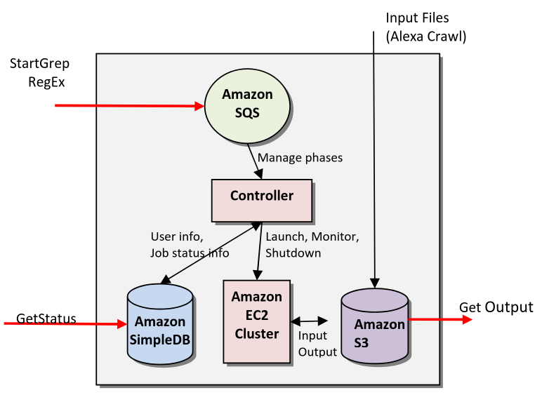

# Ab1

UML

# Ab2

## Introducing Peer to Peer Architecture in Gaming

Monolithic Structure is too expensive and too much data has to be sent

Peer to Peer Network: <br>
Every Node(Player) only has a small subset of the Data. Just as much as it is needed and a bit more for redundancy.

## Views

1. Logical view <=> Class Diagram
2. Process view <=> Sequence Diagram
3. Development view <=> packages?
4. Physical/Deployment view <=> darstellung der distribution?

create class and sequence diagram

## Architecture choice

### Suggest an architectural pattern for the following software systems. Why would you recommend this pattern here?

1. A whistleblowing system on the internet.
2. A video conferencing system
3. A GPS tracker for cat

1. Event Based - publish subscriber (wer will kann es sehen)
2. Distributed System - Peer to Peer / Client Server
3. Event Based - Broker

# Ab3 

## Aggregation + Composition

Aggregation:

Leere Raute, das Teil kann auch ohne dem Ganzen existieren z.B. Auto ohne Reifen.

Composition:

Gefüllte Raute, das Teil kann NICHT ohne dem Ganzen existieren z.B. Arm ohne Körper.

## GRASP THEROIES KLAUSURRELEVANT

### 1. Controller Principle: KLAUSURRELEVANT
Make 1 Class responsible for the given Service (Notification, Programm, Payment)<br>
(low coupling)

Problem: <br>
Who should be responsible for handling an input
system event?

Solution: <br>
Assign the responsibility for receiving or handling
a system event message to a class representing
the overall system, device, or subsystem (facade
controller) or a use case scenario within which the
system event occurs (use case controller)
### 2. Creator Principle: KLAUSURRELEVANT
Conditions of when a Class should create objects of other Classes<br>
(intuitively the controller)

Assign class B responsibility of creating instance
of class A if
- B aggregates A objects
- B contains A objects
- B records instances of A objects
- B closely uses A objects
- B has the initializing data for creating A objects

When there is a choice, prefer
- B aggregates or contains A objects

Key idea: Creator needs to keep reference   
anyway and will frequently use the created object
### 3. Information Expert Principle: KLAUSURRELEVANT
Problem: What is a general principle of assigning
responsibilities to objects?

Solution: Assign a responsibility to the
information expert, the class that has the
information necessary to fulfill the
responsibility

Start assigning responsibilities by clearly stating
responsibilities!

Typically follows common intuition

Design Classes (Software Classes) instead of
Conceptual Classes
- If Design Classes do not yet exist, look in Domain Model
for fitting abstractions (-> low representational gap)

## CRC Table

Class and ClassName are supposed to be inside the Table.

Responsibility is bullet points.

Collaboration is Class names.

Class | ClassName
| Responsibility    | Collaboration |
| ----------------- | ------------- |
| check for updates | User          |
| notify user       | Notification  |
| create new users  |               |
| track users       |               |

# Ab4

## Afferent + Efferent coupling

Afferent (incoming) coupling (AC): number of classes outside a module that depend on classes within that module

Efferent (outgoing) coupling (EC): number of classes withing a module that depend on classes outside of our module

Instability: 1 = Unstable; 0 = Stable

$$
I =\frac{EC}{EC+AC}
$$

## How to reducce coupling

Dependency Inqection

Interfaces

Abstract Methods

# Ab5

Observer Pattern

# Ab6

Strategy Pattern

## Coding Conventions

- Naming Conventions
- Comments
- Indentation Style
- Brackets
- Line Length
- Order in Classes

## When code is bad

- Duplicate Code (DRY: Dont Repeat Yourself)
- Long methods
- Speculative Generality
- Switch statements

## This is good for

- Clean Code
- Maintainability
- Ease of understanding

# Ab7

## Advantages of a Mainframe

- High computing power
- High I/O
- Availibility/Reliability
- Security
  - Not connected to the internet
- Authority over infrastructure
- Single point of truth

## Disadvantages of a Mainframe

- Expensive upfront
- Moderate maintanance costs
- Specialized Personnel needed

## Advantages of the Cloud

- Rent Cloud instead of owning your Server ```---``` | WICHTIG FÜR KLAUSUR
- Managed by Specialists ```--------------------``` | WICHTIG FÜR KLAUSUR
- Decentralized ```-----------------------------``` | WICHTIG FÜR KLAUSUR
- Scalability
- Innovation/Modernization, Cloud gets the newest Hardware over time
- Time to Market (to get it operational)

## Disadvantages of the Cloud

- Rent Cloud instead of owning your Server

## Change over time (why it developed this way)

### Cloud is:

- More cost efficient
- No training because Cloud is the same in every company
- Less training costs
- Less key employees
- Easy to scale up and down
- More accessible over the world

## Cloud implementation in AWS

# Aufgabe 3

Website class can be multithreaded to enable cloud advantages. Webiste is an Observer and contains all the logic for comparing old with new websites.

1. SimpleDB for storing Users.
2. EC2 for updating and checking the Website class (Subject).
3. S3 for saving the Website itself.
4. Controller as Main for running and creating multiple instances for the Website class.
5. SQS for adding new Websites/Users.
6. SNS Simple Notification Service for Notifying Users

The only difference would be connecting the SimpleDB to the EC2 instead of the Controller 
AND the input into the S3 is performed by the EC2 instead of a dedicated Crawler.



# Ab8

## Bugs and Tickets

Das Problem bugs in prod zu fixen ist das es sehr viel mehr arbeit braucht, mehr code and mehreren stellen geändert werden muss und alles nochmal neu getestet werden muss.

Das war aber nicht die frage.

Die Antwort auf die Frage ist einfach nur: "Wenn es mehr bugs gibt, gibt es exponentiell mehr Tickets."

Die Chance einen Bug zu finden ist größer wenn es mehr bugs gibt.

In der Klausur muss man einen exponentiellen Graphen zeichnen.

## Argument for devs testing their own code:

1. Code Knowledge
2. More efficient Time & Costs
3. Automated Testing
4. Less Code

## Argument against dev testing their own code/Arguments for a dedicated testing team:

1. Tunnel Vision
2. Different Perspective
3. Receiving Feedback from Testers
4. Testers are more skilled
5. Missing non functional aspects
6. Unintended Use

## Possible tests for comparing websites

1. Equal content size
2. Different content size
3. Equal HTML
4. Different HTML
5. Equal text
6. Different text

## Regression testing:

1. makes sure code isnt breaking other code
2. can be used on many different code
3. often automated
4. used early in development
5. might get outdated fast and not be relevant anymore

## Black Box testing:

Testing method where the internal structure, design, and implementation of the item being tested are not known to the tester.
Focuses on the functionality of the software.

## White Box Testing:

Testing method where the internal structure, design, and implementation of the item being tested are known to the tester.

## Für die Aufgabe

Zeichne eine Box mit einen Graphen drinnen für White Box und eine Box ausgemalt für Black Box.

Beide Graphen sollen ein "I" oben mit einer Verbindung haben, für Input und ein "O" unten für den Output.

# Ab9

## Costs for Projects:

devs * salary * #days

+hardware

+office costs

+licenses

+marketing

+10% buffer

**= total costs**

### Pricing Strategies

- Cost-plus pricing
- Competetive pricing
- Price elasticity-based pricing
    - Angebot-Nachfrage
- Value-based pricing
    - you need to know the value that the software provides and price it that way dev: 5k€, value provided 10mio, so price it 9mio.
- Behavioral pricing
- AI pricing?
- Regional Pricing
- Exit (being bought by Google)
- Release based of Season

## How to minimal time to market (make project go fast brrrr)

- Parallization
    - add more employees to work on different parts of the software (Frontend - Backend)
- Hire the best people

## How to choose a software development process

depends on team size

or team type (freelance, hobby project)

### Waterfall

- simple
- widespread
- (for small teams?)

### Agile

- early prototypes can already be played instead of having to wait for the finished project
- flexibility in time schedule

## How to fix a project that is over time (make project finish faster when delayed)

- Reducing Requirements/Scope
- Renegotiating Deadline
- Add Funding
- Analyze why it is over budget
    - Improve Project Management and Processes
- Increase Resources
- Less Testing